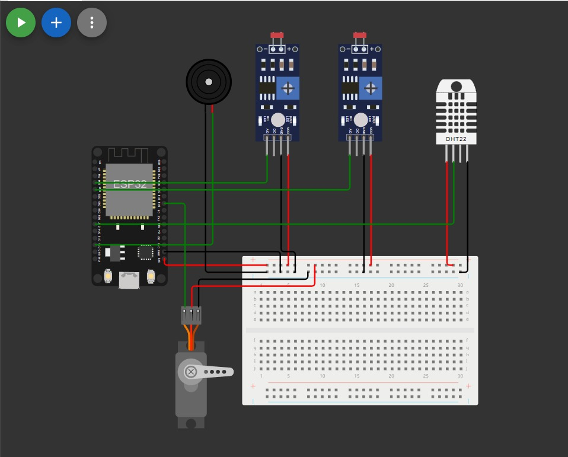

# Smart Medibox

**Smart Medibox** is an ESP32-powered system designed to remind users to take medicine on time and ensure optimal storage conditions for temperature- and light-sensitive medicines. This system offers a fully automated solution for medicine reminders and storage safety.

## Key Features

- **Alarms:**
  - Set and manage up to 3 alarms, synchronized via NTP (Network Time Protocol).
  - Notifications are delivered via a buzzer and an OLED display to ensure timely medication reminders.

- **Environment Monitoring:**
  - Continuously tracks the temperature range (26°C-32°C) and humidity levels (60%-80%).
  - If temperature or humidity exceeds these thresholds, the system issues a warning to protect the medicines.

- **Light Monitoring:**
  - Two LDR (Light Dependent Resistors) monitor ambient light intensity.
  - Real-time light data is displayed on a Node-RED dashboard, and a servo-controlled window adjusts light exposure based on the detected levels, providing optimal storage for light-sensitive medicines.

- **Node-RED Control:**
  - Users can control the window angle and the light exposure settings using sliders or preset options in the Node-RED dashboard.
  - Different preset options can be selected for specific medicines based on their storage requirements.

## Technology Stack

- **Microcontroller:** ESP32
- **Sensors:** 
  - Temperature and humidity sensors (e.g., DHT22)
  - Light sensors (LDR)
- **Actuators:** Servo motor for window control
- **User Interface:** Node-RED dashboard for remote control and monitoring
- **Display:** OLED for real-time system status
- **Alerts:** Buzzer for alarm notifications
- **Connectivity:** Wi-Fi for syncing alarms and controlling the system via Node-RED
- **Time Sync:** NTP (Network Time Protocol) for accurate alarm scheduling

